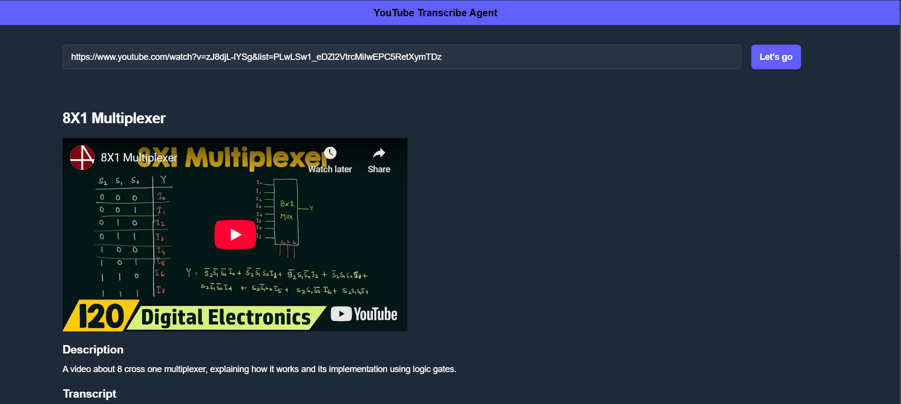

# YouTube Agent

The YouTube Agent is a tool built with React and powered by the ChatOllama language model. It allows users to fetch detailed information about YouTube videos using the `getYoutubeDetails` tool. The agent can extract key information such as video titles, descriptions, views, and more based on a YouTube URL or keywords.

## Features

- Retrieve YouTube video details like title, description, view count, and more.
- Easy integration with React and customizable via configuration.
- Built using the ChatOllama model for enhanced conversational capabilities.

## Demo

  
_Example of the YouTube Agent in action._

## Installation

Follow these steps to get the YouTube Agent up and running on your local machine.

### Prerequisites

Make sure you have the following installed:

- [Node.js](https://nodejs.org/) (v16 or higher)
- [npm](https://www.npmjs.com/) (comes with Node.js)
- [Yarn](https://yarnpkg.com/) or [pnpm](https://pnpm.io/) (optional, depending on your package manager preference)

### Steps

1. **Clone the repository** to your local machine:

   ```bash
   git clone https://github.com/your-username/your-repository-name.git
   cd your-repository-name
   ```
